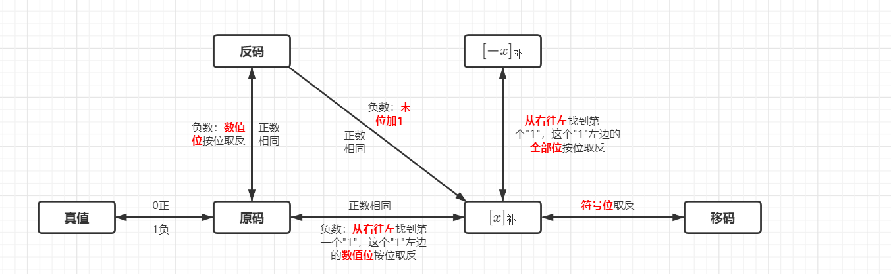

# <center> 数据表示和指令系统 <center/>

## 1. 数据表示

1. 进位计数制和转换
   1. 进制计数法——**n进制数的表示**：$K_{n}K_{n-1}\ldots K_0K_{-1}\ldots K{-m}$

   2. **n进制数的数值**：$\bm{{K_nr^n+K_{n-1}r^{n-1}+\ldots +k_{0}r^{0}+K_{-1}r^{-1}+\ldots +K_{-m}r^{-m} = \sum\limits_{i=n}^{-m}K_ir_i}}$
   3. 进制转换：
      - R进制和十进制的相互转换

      - 二、八、十六进制的相互转换

2. 定点数表示
   1. 原码、补码、反码、移码
      - 原码：1位符号位，n-1位数值位（一共n位）原码的表示范围：$-(2^n-1) \leq x \leq 2^n-1$。

      - 补码：1位符号位，n-1位数值位（一共n位）补码的表示范围：$-2^n\leq x \leq 2^n-1$。
   2. 转换

      
3. 浮点数表示
   1. 浮点数格式：$\bm{N=(-1)^S\times M\times R^E}$ 。
       ```
       一个32位短浮点数格式：[数符][阶码（或称指数）][位数]

       其中：阶码的位数反映浮点数的表示范围，阶码的值反映浮点数小数点的实际位置；尾数的位数反映浮点数的精度。
       ```

   2. 浮点数的范围和溢出：
      |正上溢|负上溢|正下溢|负下溢|
      |:---:|:---:|:---:|:---:|
      |超过了可表示的最大正数|小于可表示的最小负数|在0和可表示的最小正数之间|在可表示的最大负数和0之间|
   3. 浮点数的规格化：
       ```
       所谓规格化操作，就是通过调整尾数和阶码的大小，使非零的浮点数在尾数的最高数位上是一个有效值。
       ```
       1. 左规：当尾数出现 $\bm{\pm 0.0\ldots0XXXX}$ 的形式时，需要进行左规。

       2. 右规：当尾数出现 $\bm{\pm 1X.XXXX\ldots}$ 的形式时，需要进行右规。
4. IEEE754
   1. 规格化32位单精度浮点数：$\bm{(-1)^S\times 1.M\times 2^{E-127}}$。其中数符1位，阶码8位，尾数23位。

   2. 规格化64位双精度浮点数：$\bm{(-1)^S\times 1.M\times 2^{E-1023}}$。其中数符1位，阶码11位，位数52位。
   3. 范围：**浮点数的范围由基数和阶码的位数共同决定**。这两个越大，浮点数范围越大。
       ```
       一个32位IEEE754浮点数格式：[数符][阶码（或称指数）][尾数]

       尾数：用原码表示，由于规格化浮点数最高位总是1,所以储存时最高位省略不存。但是在计算比如对阶求阶差的时候，必须带上隐藏位。

       阶码/指数：用移码表示，这是为了方便对阶。单精度的取值范围是1～254，双精度的取值范围是1～2046。
       ```
   4. IEEE754的特殊值：

       |阶码全0，尾数全0|阶码全0，尾数非0|阶码全1，尾数全0|阶码全1，尾数非0|
       |:-------------:|:--------------:|:--------------:|:-------------:|
       |正0和负0，0的符号取决于数符|非规格化数|正无穷和负无穷|NaN|

## 2. 数据存储

1. 数据的度量和换算：例如，**当表示存储二进制时的换算关系时**，$1KB = 2^10B = 1024B$。**而当描述计算机通信带宽时**，$1KB = 10^3B = 1000B$。其他以此类推。

2. 数据存储方式
   1. 字的存放问题：
      - 大端方式：最高有效字节存放在低地址单元中，最低有效字节存放在高地址单元中。

      - 小端方式：最高有效字节存放在高地址单元中，最低有效字节存放在低地址单元中。
         ```
         大小端是对数据的存放而言的。地址永远都是左边小右边大。

         简言之，大端方式就是人读的顺序（从左往右读）和存放的顺序一样。小端方式就是人读的顺序和存放的顺序（从右往左存）相反。
         ```

   2. 字的边界对齐问题：

## 3. 指令系统

1. 概述
   1. 机器语言：直接控制计算机工作的语言。

   2. **指令：实现某个计算机基本操作的命令，指令含义决定指令格式。**
   3. CISC（复杂指令集）和RISC（精简指令集）

       ||控制方式|寄存器|编译优化|指令系统|指令周期|工作方式|指令使用频度|
       |----|:---------:|:--------:|:-----------------------:|:---:|:-:|:------:|:---:|
       |CISC|微程序控制|专用寄存器|难以编译优化生成高效目标代码|复杂的指令系统|长|各种指令都能访问存储器|二八原则|
       |RISC|以组合逻辑电路为主,<br>不用或少用微程序控制<br>|使用大量通用寄存器|优化的编译系统，<br>有效支持高级语言<br>|简化的指令系统|短|寄存器-寄存器工作方式|所有指令的使用频度都很高|

       ```
       补充：CISC机器时钟周期更长，并且研制周期长。现代计算机主要采用RISC。x86为了兼容需要，保留CISC风格，同时借鉴了RISC的思想。
       ```

2. 指令格式设计

   1. 一条指令必须包含（显式或隐式）以下信息：操作码、操作数或操作数地址、寻址方式。

   2. 指令格式设计原则：
      - 指令长度：应尽量短。**主要取决于操作码长度、操作数地址位数、地址个数**。
           ```
           RISC采用定长指令字。CISC采用变长指令字，常用的指令短，不常用的指令长。
           ```

      - 操作码：一条指令的操作码有且仅有一个，且不能有歧义。操作码位数要足够，这是为了向后兼容考虑的。 
      - 指令应尽量规整：比如长度是否固定、操作码位数是否固定等。
      - 指令长度应为字节的整数倍：便于指令读取和地址计算。
3. 指令系统设计
   1. 指令系统设计原则：**完备性、兼容性、均匀性、可扩充性**。
       ```
       兼容性指"向前/后兼容"和"向上/下兼容"。向前/后兼容简单来说就是程序在新机器和旧机器上都能运行。向上/下兼容简单来说就是程序在高级机器和低级机器上都能运行。
       ```
   2. 一个完善的指令系统应该包括：**数据传送指令、输入输出指令、算术逻辑运算指令、系统控制指令和程序控制指令、输入输出指令**。

      |数据传送指令|算术逻辑运算指令|数据转换指令|程序控制指令|系统控制指令|输入输出指令|
      |:--------:|:-----------:|:---------:|:--------:|:---:|:-:|
      |load，store，pop，push等|add，sub，ori等|FBLD、FILD、XLAT等|转移、跳跃、子程序调用和返回、循环控制等|只能由系统执行的特权指令|输入、输出、启动IO、测试IO等|

4. 操作码编码
   ```
   操作码字段可以是固定长度，也可以是可变长度。若希望降低空间开销，则选择更为紧凑的变长操作码和指令字。若希望降低时间开销，则选择定长操作码和定长指令字。
   ```
   1. 定长操作码编码：译码方便，执行执行速度快。但有信息冗余。

   1. 拓展操作码编码：
      1. 分为等长方式扩展（如4-8-12、3-6-9）和不等长方式扩展。

      2. 原则：高频指令用短码，低频指令用长码。
      3. 思想：操作码按短到长进行扩展编码。

5. 地址码编码
   ```
   一条指令包含一个操作码和多个地址码，地址码的编码由操作数的寻址方式决定。
   ```
   1. 区分以下几类指令：零地址、一地址、二地址、三地址、多地址。

6. 寻址方式
   ```
   通常把指令中给出的操作数所在的存储单元的地址称为有效地址。有效地址可以是物理地址（不采用虚拟存储），也可以是虚拟地址（采用虚拟存储）。
   ```

   1. 立即数寻址、直接寻址、间接寻址、寄存器直接寻址、寄存器间接寻址

       ||立即数寻址|直接寻址|间接寻址|寄存器直接寻址|寄存器间接寻址|
       |:-----:|:-----:|:-----:|:-----:|:-----:|:-----:|
       |地址码含义|操作数|操作数的有效地址|存放操作数有效地址的主存单元地址|操作数所在的寄存器编号|存放操作数有效地址的寄存器编号|
       |优点|执行时间短,<br>无需访存<br>|处理简单，直接|寻址空间大,<br>灵活且易于编程<br>|秩序很短的地址字段,<br>不需要访存<br>|寻址空间大|
       |缺点|只能作为源操作数,<br>操作数大小受限<br>|寻址空间受限|执行速度慢,<br>需要至少两次访存才能取到操作数<br>|地址范围有限,<br>可用的通用寄存器有限<br>|至少进行一次访存|
      ```
      间接寻址不仅有单级间接寻址，还有多重间接寻址。
      ```

   2. 偏移寻址（变址寻址、相对寻址、基址寻址）、堆栈寻址

      1. 一些机器中允许变址与间址结合使用。设变址寄存器I，形式地址A。
         - 先变址后间址（前变址）：EA = ((I) + A)。

         - 先间址后变址（后变址）：EA = (I) + (A)。

      2. **相对寻址方式一般用来实现公共子程序的浮动或实现相对转移**。
      3. **基址寻址方式一般用来实现程序的动态重定位**。主要面向系统，解决程序逻辑空间与存储器物理空间的无关性。基址寄存器内容不可由用户修改。
      4. **变址寻址方式一般用于处理数组等问题**。主要面向用户，为用户编写高效访问一片存储区域提供支持。

           ||变址寻址|相对寻址|基址寻址|
           |:-:|:------:|:-------:|:-------:|
           |基地址|由指令中的地址码字段给出|由PC隐式的给出|由基址寄存器显式或隐式的给出|
           |偏移地址|在指令中显式或隐式的由变址寄存器给出|在指令中的地址码字段给出|在指令中的地址码字段给出|

         ```
         注意：相对寻址给出的偏移量是一个带符号整数。指令中的地址码字段又称为形式地址。
         ```

## 4. 程序